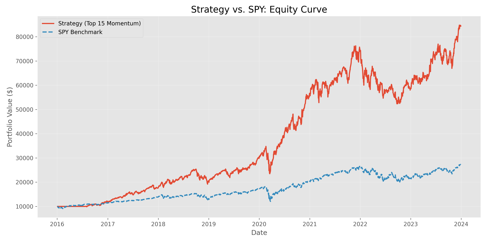
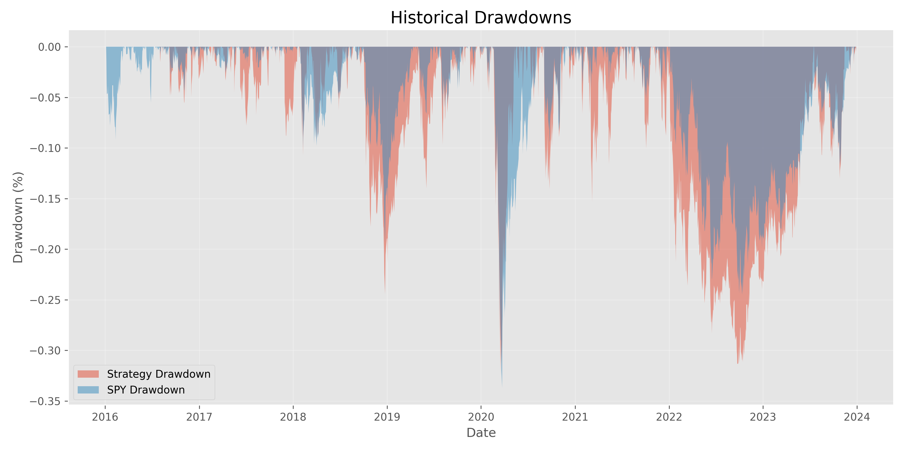
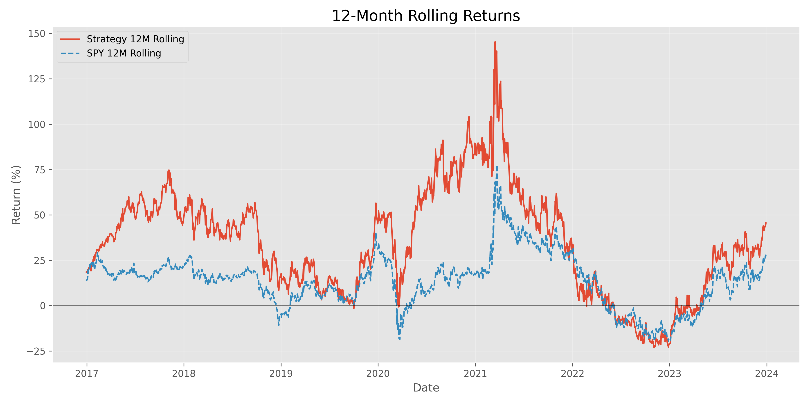

# Momentum Backtest — Version 1 Report

> **Status:** Finalized  
> **Author:** Quantitative Research  
> **Date:** April 2026

---

## 1. Hypothesis

> *Stocks with strong recent momentum may continue outperforming in the short to medium term.*

The efficient market hypothesis assumes prices fully reflect all available information, leaving no room for systematic excess returns. This backtest challenges that assumption by testing whether a simple price-momentum signal — selecting the stocks that have risen the most over the past six months — can generate risk-adjusted outperformance over a passive benchmark across a multi-year horizon.

---

## 2. Methodology

### Universe
- **Primary:** Nasdaq-100 (Sample of 50 Large-Cap Tech / Growth stocks)
- **Benchmark:** SPDR S&P 500 ETF Trust (`SPY`)

### Time Period
- **Start:** 2016-01-01
- **End:** 2024-01-01
- **Duration:** 8 years

### Momentum Factor
- **Definition:** 6-month simple price return (126 trading days)
- **Computed on:** Adjusted close prices via `yfinance`

### Portfolio Construction
| Parameter | Value |
|---|---|
| Selection rule | Top 15 stocks by 6-month momentum score |
| Weighting | Equal weight (1/15 per stock) |
| Rebalance frequency | Monthly (Last trading day of the month) |
| Look-ahead bias protection | Weights shifted forward 1 trading day |

### Benchmark
- SPY held as a passive buy-and-hold position starting at $10,000.

---

## 3. Results

### Performance Summary

| Metric | Strategy | SPY Benchmark |
|---|---|---|
| **Total Return** | **743.82%** | 172.25% |
| **CAGR** | **30.62%** | 13.37% |
| **Annualized Volatility** | 25.35% | 18.39% |
| **Sharpe Ratio** | **1.18** | 0.77 |
| **Max Drawdown** | **-32.46%** | -33.72% |

### Relative Performance

| Comparison | Outcome |
|---|---|
| Total return vs SPY | **Significant Outperformance (+571.57%)** |
| Risk-adjusted (Sharpe) vs SPY | **Higher (1.18 vs 0.77)** |
| Drawdown vs SPY | **Slightly Shallower (-32.46% vs -33.72%)** |

### Equity Curve

### Drawdown Chart

### 12-Month Rolling Returns

---

## 4. Interpretation

**Did the strategy work?**  
**Yes.** The strategy delivered a CAGR of 30.62%, more than double the SPY's 13.37%. With a Sharpe ratio of 1.18, it provided superior risk-adjusted returns compared to the benchmark's 0.77.

**When did it work best?**  
The strategy thrived during the sustained bull markets of 2017 and the post-COVID recovery of 2020–2021. Its focus on the Nasdaq-100's top momentum names captured the explosive growth of the technology sector during these periods.

**Was it more volatile than SPY?**  
**Yes.** Annualized volatility was 25.35% compared to SPY’s 18.39%. This is expected given the concentrated nature of a 15-stock portfolio versus a 500-stock index.

**Was the outperformance worth the risk?**  
**Definitely.** The significant jump in Sharpe ratio indicates that the extra volatility was well-compensated by the massive excess returns. Remarkably, despite the higher volatility, the strategy's maximum drawdown was slightly *lower* than SPY’s during the 2022 market correction.

---

## 5. Limitations

This Version 1 backtest carries several structural weaknesses that should be addressed in future iterations.

### 5.1 Survivorship Bias
The universe is drawn from *current* Nasdaq-100 membership. This ignores stocks that were in the index in 2016 but were later removed or went bankrupt, inherently biasing results toward companies that remained successful.

### 5.2 Lack of Transaction Costs
The simulation assumes zero costs for rebalancing. With 15 stocks being shuffled monthly, cumulative brokerage fees and bid-ask spreads would likely reduce the final return by several percentage points.

### 5.3 No Slippage
All trades are assumed to execute at the exact closing price. In reality, large rebalance orders would create market impact, especially in faster-moving momentum stocks.

### 5.4 Static Universe membership
We used current membership for the entire 8-year window. A truly rigorous backtest would use "Point-in-Time" membership data to reflect exactly which stocks were reachable by the strategy on any given date.

### 5.5 Price-Only Factor
The strategy relies purely on past price performance. It is "blind" to valuation or fundamentals, making it vulnerable to "Momentum Crashes" — sharp reversals where market leaders are sold off rapidly.

---

## Next Steps — Version 2

| Improvement | Priority |
|---|---|
| Add transaction cost model (10 bps per trade) | High |
| Source historical index membership data | High |
| Combine momentum with a quality or low-volatility filter | Medium |
| Introduce position sizing by inverse volatility | Medium |
